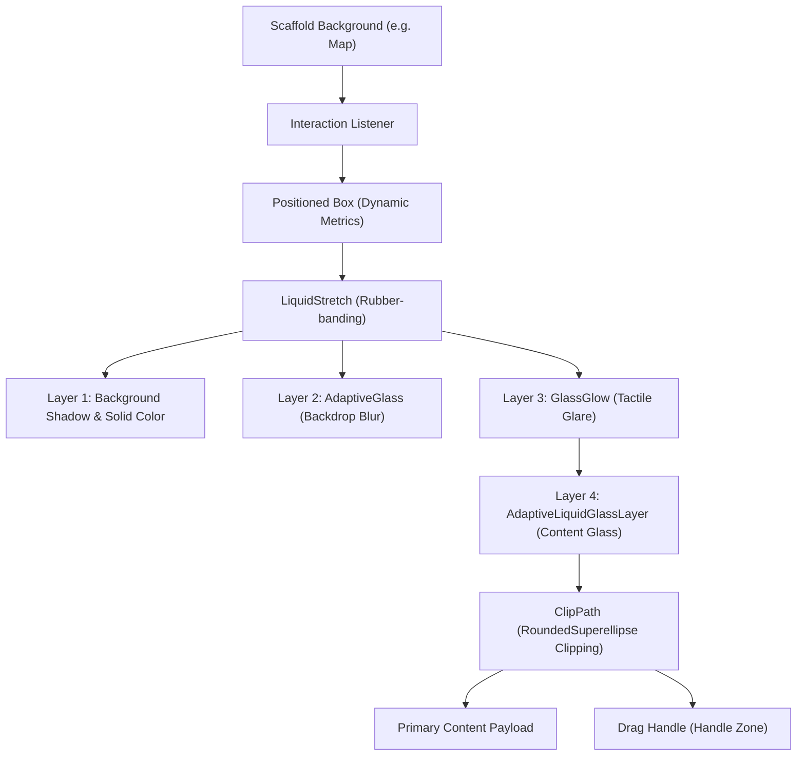

# Complete Guide to GlassModalSheet (Ultimate Edition)

This is the ultimate, 101% recursive technical reference for the `GlassModalSheet` widget. It documents every parameter, architectural decision, gesture logic, and internal communication protocol. No information is omitted.

---

## 1. Core Lifecycle & Navigation
Settings for the primary content and the sheet's basic behavior.

| Parameter | Type | Default | What it does (Technical Detail) |
| :--- | :--- | :--- | :--- |
| `child` | `Widget` | **Required** | The primary payload widget. Wrapped in a `RepaintBoundary` and `Material` for performance and consistent elevation rendering. |
| `builder` | `WidgetBuilder` | **Required** | (In `show`) Deferred builder to ensure `BuildContext` is available for theme lookups inside the sheet. |
| `initialState` | `SheetState` | `half` | Sets the initial `ValueNotifier<SheetState>` value. Triggers haptic feedback immediately on mount if `peek` or `hidden`. |
| `mode` | `SheetMode` | `dismissible` | Logic gate for the state machine. `dismissible` allows `resolveTarget` to include `hidden`. `persistent` clamps `minState` to `peek`. |
| `controller` | `GlassModalSheetController?` | `null` | A synchronization bridge. Attaches to `_GlassModalSheetState` to provide imperative access to the underlying `AnimationController`. |
| `onStateChanged` | `ValueChanged?` | `null` | Emits when `_currentState` changes. Fired *after* state update but *before* snap animation completes. |
| `padding` | `EdgeInsetsGeometry?` | `null` | Applied to the content zone via `Padding` widget, positioned below the 44px handle zone. |
| `barrierColor` | `Color` | `black54` | (In `show`) The `barrierColor` of the `GeneralDialog`. Tap logic is handled by a `GestureDetector` in the `Scaffold`. |
| `isDismissible` | `bool` | `true` | (In `show`) Controls `barrierDismissible`. If `true`, the `Scaffold` background triggers `snapToState(SheetState.hidden)`. |
| `useRootNavigator` | `bool` | `false` | (In `show`) If true, pushes the modal onto the top-level `Navigator`, bypassing local navigation stacks. |
| `barrierLabel` | `String` | `'Dismiss'` | Accessibility label for the modal barrier. |

---

## 2. Mastering Content & Interaction (The Pro Way)
To make your content feel integrated with the "Liquid Glass" system, use these advanced techniques.

### 2.1. Scrolling Synchronization
If you have a list inside the sheet, you MUST use the provided scroll controller for a seamless experience:
```dart
final scrollData = ScrollControllerProvider.of(context);
return ListView(
  controller: scrollData?.controller, // Syncs list scrolling with sheet dragging
  physics: scrollData?.physics,       // Ensures smooth snapping
  children: [...],
);
```

### 2.2. Reactive UI (Morphing UI)
You can animate your own widgets based on how much the sheet is open:
```dart
final state = GlassModalSheetStateProvider.of(context);
final progress = state?.progress ?? 0.0; // 0.0 (Peek) to 1.0 (Full)

return Opacity(
  opacity: progress, // Fade in content as the sheet expands
  child: MyComplexWidget(),
);
```

### 2.3. Smart Silence (`suppressInteractionOnChildren`)
When you have buttons or cards inside the sheet:
- `false` (Default): Touching a button will also trigger the sheet's "squeeze" scale effect. Good for a very fluid, "jiggly" feel.
- `true`: Touching a button will only trigger the button's own effect. The sheet stays stable. **Recommended for complex forms and Maps-style UI.**

### 2.4. Communication with InteractionNotification
You can control the sheet's behavior from deep within the widget tree. Children can dispatch a notification to tell the sheet "I am being touched, don't jitter!".

```dart
// Children (Buttons/Sliders) can do this to silence the sheet's scale effects
InteractionNotification(event).dispatch(context);
```

*Internal Logic:* When `suppressInteractionOnChildren` is `true`, the sheet listens for this notification. If caught, it sets `_suppressScalingForSession = true`, forcing the `interactionScale` to `1.0` and `stretch` to `0.0` for the remainder of the pointer session.

---

## 3. Advanced Geometry & Morphing
This is where you configure the physical shape-shifting "Apple Maps" effect.

### Dimensions & Gaps
| Parameter | Type | Default | What it does (Technical Logic) |
| :--- | :--- | :--- | :--- |
| `halfSize` | `double` | `0.45` | `(x > 1.0 ? x / screenHeight : x)`. Resolves to absolute pixels if > 1.0, otherwise fraction. |
| `fullSize` | `double?` | `null` | If `null`, defaults to `(screenHeight - 90) / screenHeight` to mimic iOS system page sheets. |
| `peekSize` | `double` | `90.0` | Minimum visible height. In `persistent` mode, this is the floor for all gestures. |
| `horizontalMargin` | `double` | `8.0` | Base side margin. Lerps to `0.0` during the last 20% of the expansion to `full`. |
| `peekHorizontalMargin`| `double?` | `null` | If provided, margin lerps from this value to `horizontalMargin` during Peek→Half transition. |
| `bottomMargin` | `double` | `8.0` | Base bottom margin. In `full` state, lerps to `-extraHeight` to hide the bottom rounded edge. |
| `peekBottomMargin` | `double?` | `null` | Distance from bottom in Peek state. Allows "Floating Pill" look. |
| `peekWidth` | `double?` | `null` | If set, `hPad` is calculated as `(screenWidth - peekWidth) / 2`. Morphs to full width on expansion. |

### Corner Rounding (Border Radius)
*Tip: Null values trigger `GlassThemeHelpers.resolveAdaptiveRadius`, which fetches system-level corner radius values (e.g., iPhone 15 Pro Max = 53.0).*

| Parameter | Type | Default | What it does (Technical Logic) |
| :--- | :--- | :--- | :--- |
| `topBorderRadius` | `double?` | `null` | Radius for Half state. Multiplied by `interactionScale` during touch. |
| `bottomBorderRadius` | `double?` | `null` | Radius for Half state. Lerps to `bottomRadiusFull` during expansion. |
| `peekTopBorderRadius` | `double?` | `null` | Specific top radius for Peek. Morphs to `topBorderRadius` via `Curves.easeOut`. |
| `peekBottomRadius` | `double?` | `null` | Specific bottom radius for Peek. Morphs to `bottomBorderRadius`. |
| `fullTopBorderRadius` | `double?` | `46.0` | Target radius for `full` state. Usually smaller than `adaptive` for a tighter look. |
| `fullBottomBorderRadius`| `double?` | `null` | Target bottom radius for `full`. Defaults to `bottomBorderRadius` if null. |

---

## 4. Visual Glass Effects & Material States
Configure the realism of the glass and how it turns into a solid color.

| Parameter | Type | Default | What it does (Simple Terms) |
| :--- | :--- | :--- | :--- |
| `settings` | `LiquidGlassSettings?` | `null` | Main glass material recipe (blur, thickness, lighting). |
| `quality` | `GlassQuality?` | `standard` | Rendering engine: Standard, Premium, or Minimal. |
| `expandedColor` | `Color?` | `null` | Solid background color used in Full state when opaque. |
| `fillThreshold` | `double` | `0.60` | At what point (0 to 1) the glass starts turning into a solid color. |
| `fillTransition` | `FillTransition` | `instant` | `gradual`: fades smoothly into color. `instant`: snaps to color. |
| `forceSpecularRim` | `bool` | `false` | **Critical for Web/Skia**: Forces the shiny edge highlight. |

### Per-State Overrides
- `peekSettings`: Custom glass material specifically for the `peek` state.
- `halfSettings`: Custom glass material specifically for the `half` state.
- `fullSettings`: Custom glass material specifically for the `full` state.

---

## 5. Interaction & Tactile Feedback
| Parameter | Type | Default | What it does (Simple Terms) |
| :--- | :--- | :--- | :--- |
| `interactionScale` | `double` | `1.01` | How much the sheet "squeezes" on touch. |
| `enableInteractionGlow` | `bool` | `true` | Dynamic light glow following your touch point. |
| `enableSaturationGlow` | `bool` | `true` | Saturation pulse on the entire sheet background on touch. |
| `glowColor` | `Color?` | `null` | Custom color for the tactile glare. |
| `glowRadius` | `double` | `1.5` | Size of the touch glare effect. |

---

## 6. Headers, Polish & Content
| Parameter | Type | Default | What it does (Simple Terms) |
| :--- | :--- | :--- | :--- |
| `showDragIndicator` | `bool` | `true` | Toggle the horizontal grab handle at the top. |
| `dragIndicatorColor` | `Color?` | `null` | Custom color for the grab handle bar. |
| `enableTopFade` | `bool` | `false` | Gradient fade-out at the top edge in Full state. |
| `topFadeHeight` | `double` | `40.0` | Depth of the top fade-out zone. |
| `maintainContentGlass` | `bool` | `true` | Keep items glassy even if background becomes solid. |
| `fullStateContentSettings` | `Settings?` | `null` | Glass look for inner items specifically in Full state. |

---

## 7. Physics & Drag Mechanics
| Parameter | Type | Default | What it does (Technical Logic) |
| :--- | :--- | :--- | :--- |
| `stretch` | `double` | `0.5` | Multiplier for the rubber-band effect when dragging beyond the 1.0 (Full) or 0.0 (Hidden/Peek) bounds. |
| `resistance` | `double` | `0.08` | Exponential decay factor for dragging. Higher = more force needed to move off-state. |
| `snapThreshold` | `double` | `0.4` | Percentage of the distance between two states (e.g. Half to Full) needed to trigger a snap. |
| `velocityThreshold` | `double` | `700.0` | Points per second. If drag ends with velocity > this, we jump states regardless of position. |
| `enablePeek` | `bool?` | `null` | Logic override. If `null`, derived from `mode` (`persistent` = true). |

---

## 8. The Brain: Inside SheetSnapshot & Geometry
The internal "Mechanics" engine uses these concepts to decide where to snap.

### SheetSnapshot (Current State Data)
- `state`: The current `SheetState` enum.
- `position`: Vertical position (0.0 at screen bottom, 1.0 at screen top).
- `velocity`: Movement speed in pixels/second (signed: positive is upwards).
- `screenSize`: Cached `Size` used for fraction-to-pixel conversions.
- `expandProgress`: Computed getter: `(pos - halfPos) / (fullPos - halfPos)`.

### The Gesture Arena
The `GestureArena` coordinates between the sheet and its scrollable children:
1. **Handle Drag**: Triggered if touch starts in the top 44px of the sheet. Bypass scroll logic.
2. **Content Drag**: Triggered if touch starts on sheet background.
3. **Scroll Redirection**: 
   - If `state == full`: 
     - Swipe Up: Always scrolls the list (`GesturePhase.scrolling`).
     - Swipe Down: If `scrollController.offset > 0`, scrolls list. If at `0.0`, claims gesture for sheet (`GesturePhase.contentDrag`).
   - If `state != full`: Sheet always claims the gesture.

### The Physics Simulation
The sheet uses a `SpringSimulation` for all snapping:
- `mass: 1.0`
- `stiffness: 220.0`
- `damping: 30.0`
This creates the signature "Liquid" snap that feels firm yet bouncy.

---

## 9. Render Metrics & Logic (The Math)
Every frame, `_calculateMetrics` computes the visual state based on `_currentPosition`.

### Layer Opacity Transition
- **Below Half**: Lerps between `peekSettings` and `halfSettings`.
- **Above Half**: 
  - If `FillTransition.gradual`: Opacity follows a `Curves.easeInOutCubic` curve starting at `fillThreshold`.
  - If `FillTransition.instant`: Opacity snaps from 0.0 to 1.0 at exactly `fillThreshold`.
- **Plateau Effect**: A small `0.04` plateau is added to the fade range to prevent "flickering" near the threshold.

### Geometric Lerping
- `hPad`: side margin. Lerps to 0 during expansion.
- `effectiveBottom`: bottom margin. Lerps to `-extraHeight` (negative) to hide the bottom rounding of the sheet under the screen edge.
- `effectiveHeight`: Total widget height. Calculated as `targetVisualHeight - effectiveBottom`.

---

## 10. Performance & Rendering Tiers
The system uses an adaptive resolution engine to ensure 120fps on ProMotion displays while falling back gracefully on low-end hardware.

| Quality | Tech Behind It | Performance Impact | Best Used For |
| :--- | :--- | :--- | :--- |
| **Minimal** | `BackdropFilter` | Very Low | Legacy Skia/Web where custom shaders are slow. Uses basic RRect clipping. |
| **Standard** | `LiquidGlass` Shader | Low | Optimized fragment shader. Handles blur and tint in one pass. |
| **Premium** | `LiquidSuperellipse` | Medium-High | Deeply math-heavy. Uses `RoundedSuperellipseBorder` for "Squircle" edges. |

### The Quality Priority Chain (5 Levels)
Resolved via `GlassThemeHelpers.resolveQuality` in this order:
1. **Widget Explicit**: `GlassModalSheet(quality: ...)` wins unconditionally.
2. **Inherited Ancestor**: `AdaptiveLiquidGlassLayer(quality: ...)` in the tree.
3. **Adaptive Ceiling**: `GlassAdaptiveScope` (if present) caps the result (e.g., downscales Premium to Standard on old phones).
4. **Theme Quality**: `GlassThemeData.qualityFor(context)`.
5. **Widget Fallback**: `GlassModalSheet` defaults to `standard`.

### The Settings Priority Chain (5 Levels)
Resolved via `GlassThemeHelpers.resolveSettings`:
1. **Widget Explicit**: `settings:` parameter.
2. **Inherited Ancestor**: Settings from nearest `AdaptiveLiquidGlassLayer`.
3. **Global Override**: `LiquidGlassWidgets.globalSettings`.
4. **Theme Data**: Brightness-aware settings from `GlassTheme`.
5. **Absolute Default**: `kDefaultSheetSettings`.

---

## 11. Adaptive Radius Resolution Table
When `topBorderRadius` or `bottomBorderRadius` is `null`, the sheet automatically adapts to the device's physical screen curvature.

| Device Type / Context | Resolved Radius | Trigger Logic |
| :--- | :--- | :--- |
| **Desktop / Home Button iPhone** | `0.0` | `bottomSafeArea == 0` |
| **iPhone Pro Max (Island)** | `64.0` | `height >= 900` or `topSafeArea >= 59` |
| **iPhone Pro / Base (Island)**| `50.0` | `height >= 800` or `topSafeArea >= 54` |
| **iPhone with Notch** | `44.0` | Standard iOS SafeArea |
| **Android (Gesture Nav)** | `28.0` | `bottomSafeArea > 0` on Android |
| **Theme Override** | `theme.radius` | Custom value set in `GlassThemeData` |

---

## 12. Under the Hood: Layout Optimizations
To maintain 120fps during complex morphing animations, the sheet implements several "Silent" optimizations:

- **RepaintBoundaries**: 
  - Content Payload
  - Handle Zone (Grab Bar)
  - Scaffold Background
  This ensures that moving the sheet doesn't force a rebuild/repaint of the complex background map or the internal list content.
- **Focus Bridge**: Uses a `Focus` widget with a `GlobalObjectKey(widget.child)`. When a text field inside the sheet is focused, the bridge automatically triggers `snapToState(SheetState.full)` to prevent the keyboard from obscuring the input.
- **Metrics Jitter Filter**: In `didChangeMetrics`, the sheet compares the new `physicalSize` with the cached one to ignore system "spam" calls that don't actually change the window dimensions.

---

## 13. The Internal Rendering Stack
The `_SheetLayout` builds a complex stack of 4 distinct glass-aware layers to achieve its high-fidelity look.



### Layer Breakdown:
1. **Physical Container**: A `DecoratedBox` that provides the `BoxShadow` and the `expandedColor`. It uses `RoundedSuperellipseBorder` for consistent curvature.
2. **Backdrop Layer**: Uses `AdaptiveGlass` with `useOwnLayer: true`. This layer is responsible for the actual "frosted" look of the sheet's background. It fades out as the sheet becomes solid.
3. **Tactile Layer**: `GlassGlow` tracks the user's pointer. If `enableInteractionGlow` is on, it draws a radial gradient at the touch point, clipped to the sheet's shape.
4. **Content Layer**: `AdaptiveLiquidGlassLayer` ensures that widgets *inside* the sheet can also have glassy properties (if `maintainContentGlass` is true), even if the sheet's background is solid.

### Geometric Precision:
- **`_RadiusClipper`**: A custom `ClipPath` that uses the `RoundedSuperellipseBorder` logic to ensure that the content clipping perfectly matches the shader-drawn background borders, preventing sub-pixel "bleeding" or gaps.
- **Adaptive Insets**: The `extraHeight` calculation (`mqPadding.bottom + topRadiusBase`) ensures that in `full` state, the sheet's bottom rounding is pushed exactly far enough below the screen to look like a perfectly flat edge.

---

## 14. LiquidGlassSettings (Internal Material Recipe)
| Parameter | Type | Default | What it does |
| :--- | :--- | :--- | :--- |
| `blur` | `double` | `10.0` | Frosting intensity. Lerps to `0.0` in solid state. |
| `thickness` | `double` | `10.0` | Depth of the glass. Affects how much the rim catches light. |
| `refractiveIndex` | `double` | `0.15` | Edge highlight intensity. Specifically tuned for iOS 26. |
| `chromaticAberration`| `double` | `0.0` | Rainbow fringing. Disabled by default for sheet performance. |
| `saturation` | `double` | `1.2` | Background color boost. Pulses during touch interaction. |
| `lightIntensity` | `double` | `0.7` | Brightness of the specular rim (top/left highlight). |
| `lightAngle` | `double` | `2.356` | 135 degrees (upper-left). Standard iOS lighting. |
| `ambientStrength` | `double` | `0.4` | Baseline brightness of the glass surface. |
| `glassColor` | `Color` | `0x1FFFFFFF`| 12% White tint (iOS 26 standard). |

---

## 15. Advanced Scoping: Inherited Widgets
The sheet provides two critical data providers to its subtree.

### `ScrollControllerProvider`
Allows children (like `ListView`) to synchronize their scroll state with the sheet's drag state.
- `controller`: The `ScrollController` managed by the sheet.
- `physics`: 
  - `_ClampingTopScrollPhysics`: Used in `full` state. Bounces at the bottom, but clamps at the top to allow "pull-down-to-resize" gestures.
  - `NeverScrollableScrollPhysics`: Used in non-full states to prevent list scrolling from interfering with sheet dragging.

### `GlassModalSheetStateProvider`
Provides real-time telemetry to children.
- `state`: Current `SheetState`.
- `progress`: 0.0 to 1.0 (from current min state to full).
- `isExpanded`: Boolean shorthand for `progress > 0.9`.

---

## 16. Accessibility & Semantics
- **Drag Handle**: Wrapped in `Semantics` with label "Drag handle" and hint "Swipe down to dismiss".
- **Focus Bridge**: Uses a `Focus` widget to automatically snap the sheet to `full` state if a child (like a `TextField`) gains focus.
- **Haptics**:
  - `selectionClick()`: Fired on initial touch.
  - `lightImpact()`: Fired when snapping to `peek` or `hidden`.
  - `mediumImpact()`: Fired when snapping to `half` or `full`.

---

## 17. The Frozen State (Interaction Lock)
When the user touches the sheet background and pulls up, the sheet "freezes" its bottom edge to prevent visual gaps. This is tracked by the `FrozenState` class:
- `bottomScale`: The scale factor at the moment of freeze.
- `heightAtFreeze`: The physical height of the sheet when the gesture claimed the arena.
This ensures that the "squeeze" effect feels anchored to the user's thumb.

---

## 18. Hot Reload & Adaptive Layout
- **didUpdateWidget**: If `halfSize` or `fullSize` changes (during development), the sheet automatically re-snaps to its current state using a spring animation to reflect new dimensions.
- **didChangeMetrics**: The sheet listens to window size changes (keyboard opening, orientation change). It recalculates its `_screenSize` and re-snaps to maintain its relative position.

---

## 19. The Controller (Programmatic Logic)
The `GlassModalSheetController` provides imperative control over the sheet's state without requiring a rebuild of the parent widget.

- `snapToState(state, {animate = true, velocity = 0.0})`: Programmatically moves the sheet to a specific state.
- `value`: (Getter/Setter) Directly sets the position fraction (0.0 to 1.0). Setting this jumps the sheet without animation.
- `currentState`: Returns the current `SheetState`.
- `isAttached`: Boolean indicating if the controller is currently linked to a living `GlassModalSheet`.

---

## 20. Data Types & Enums Reference

### SheetState
- `hidden`: Completely off-screen.
- `peek`: Minimal visible state (e.g., a "Now Playing" bar).
- `half`: The default middle-ground state.
- `full`: Max expansion (usually screen height minus safe area).

### SheetMode
- `dismissible`: The user can swipe the sheet down to the `hidden` state.
- `persistent`: The sheet is "locked" to the screen. Swiping down stops at the `peek` state.

### GlassQuality
- `minimal`: Uses `BackdropFilter`. Best for performance on low-end web/skia.
- `standard`: The default. High-performance fragment shader.
- `premium`: High-fidelity. Uses Superellipse math and optional aberration.

### FillTransition
- `instant`: Background color snaps to `expandedColor` at the `fillThreshold`.
- `gradual`: Background color lerps from transparent to `expandedColor` as you pull up.

---

## 21. GlassModalSheetScaffold (Hit-Through Navigation)
For a true "Apple Maps" experience where you can interact with the background while the sheet is open, use `GlassModalSheetScaffold` instead of `GlassModalSheet.show()`.

```dart
return GlassModalSheetScaffold(
  background: MyInteractiveMap(), // This remains interactive!
  sheetChild: MySheetContent(),   // The glass sheet on top
  initialState: SheetState.peek,
  mode: SheetMode.persistent,
  // ... other GlassModalSheet parameters ...
);
```

### Why use the Scaffold?
- **Hit-Through Interaction**: Unlike `show()` which pushes a new route (blocking everything behind), the Scaffold places both the background and the sheet in the same stack.
- **Persistent UI**: Ideal for "Now Playing" bars or persistent search bars that should never be fully dismissed.
- **Performance**: Avoids the overhead of route transitions when simply changing the sheet's state.

---

## 22. The Golden Rendering Constants
Deep within the `_calculateMetrics` engine, these hardcoded values ensure the "Liquid" feel:

- **Apple Maps Speed (`0.15`)**: Morphing (margins, radii) between `peek` and `half` is compressed into the first 15% of movement. This creates that "snappy" feeling when pulling a mini-player up.
- **Bottom Sync Threshold (`0.90`)**: At 90% expansion, the sheet starts a specialized sync to hide its bottom rounding. By the time it reaches 100%, the bottom is exactly `-extraHeight` pixels below the screen.
- **Flicker Plateau (`0.04`)**: A 4% safety margin in the fade-in logic for `expandedColor`. This prevents the shader from flickering if the sheet "jitters" exactly on the `fillThreshold`.
- **Velocity Snapping (`700.0`)**: Any flick faster than 700 pixels/sec ignores position logic and forces a jump to the next logical state in the direction of the flick.

---

## 23. The Recipe Book: 10 Masterclass Scenarios

### 1. The Classic iOS Modal
```dart
GlassModalSheet.show(
  context: context,
  initialState: SheetState.half,
  mode: SheetMode.dismissible,
  builder: (context) => MyContent(),
);
```

### 2. The Always-on Music Player
```dart
GlassModalSheet.show(
  context: context,
  initialState: SheetState.peek,
  mode: SheetMode.persistent,
  peekSize: 80, // Height of the mini-player
  builder: (context) => MiniPlayer(),
);
```

### 3. Apple Maps Morphing Pill (Floating)
```dart
GlassModalSheet.show(
  context: context,
  mode: SheetMode.persistent,
  peekWidth: 340,         // Width of the floating pill
  peekSize: 72,          // Height of the pill
  peekBottomMargin: 32,  // Distance from bottom
  peekTopBorderRadius: 36,
  peekBottomRadius: 36,
  builder: (context) => SearchInput(),
);
```

### 4. Hero Section (Ultra-High-Fidelity)
```dart
GlassModalSheet.show(
  context: context,
  quality: GlassQuality.premium,
  forceSpecularRim: true,
  settings: LiquidGlassSettings(
    blur: 40,
    chromaticAberration: 0.06,
    saturation: 1.8,
  ),
  builder: (context) => HeroBanner(),
);
```

### 5. Settings List (Minimalist)
```dart
GlassModalSheet.show(
  context: context,
  horizontalMargin: 0,
  bottomMargin: 0,
  topBorderRadius: 16,
  quality: GlassQuality.minimal,
  builder: (context) => SettingsList(),
);
```

### 6. Gradual Dark Transition
```dart
GlassModalSheet.show(
  context: context,
  fillThreshold: 0.4,
  fillTransition: FillTransition.gradual,
  expandedColor: Colors.black,
  builder: (context) => DarkUI(),
);
```

### 7. Interactive Map Overlay (Smart Silence)
```dart
GlassModalSheet.show(
  context: context,
  suppressInteractionOnChildren: true, // Buttons won't jiggle the sheet
  builder: (context) => InteractiveMenu(),
);
```

### 8. Programmatic Task Flow
```dart
final controller = GlassModalSheetController();
// ...
onComplete: () => controller.snapToState(SheetState.full);
```

### 9. Responsive Scroll Sync
```dart
final scroll = ScrollControllerProvider.of(context);
return ListView(
  controller: scroll?.controller,
  physics: scroll?.physics,
  children: [...],
);
```

### 10. Persistent Security Alert
```dart
GlassModalSheet.show(
  context: context,
  mode: SheetMode.persistent,
  isDismissible: false,
  barrierColor: Colors.black87,
  builder: (context) => SecurityPrompt(),
);
```
